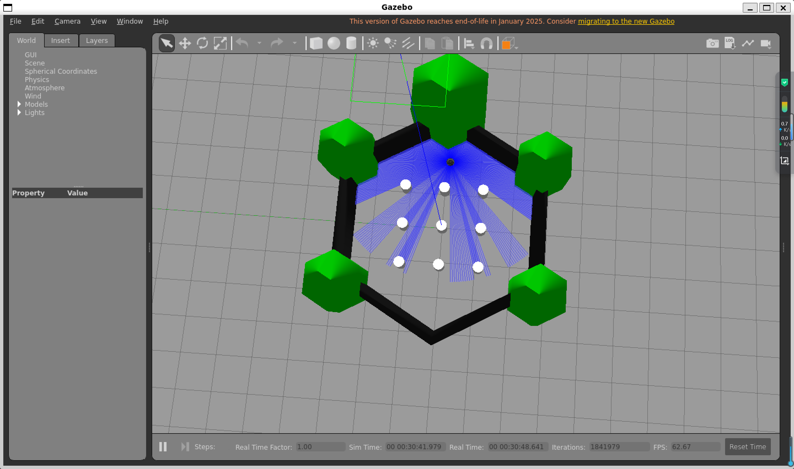
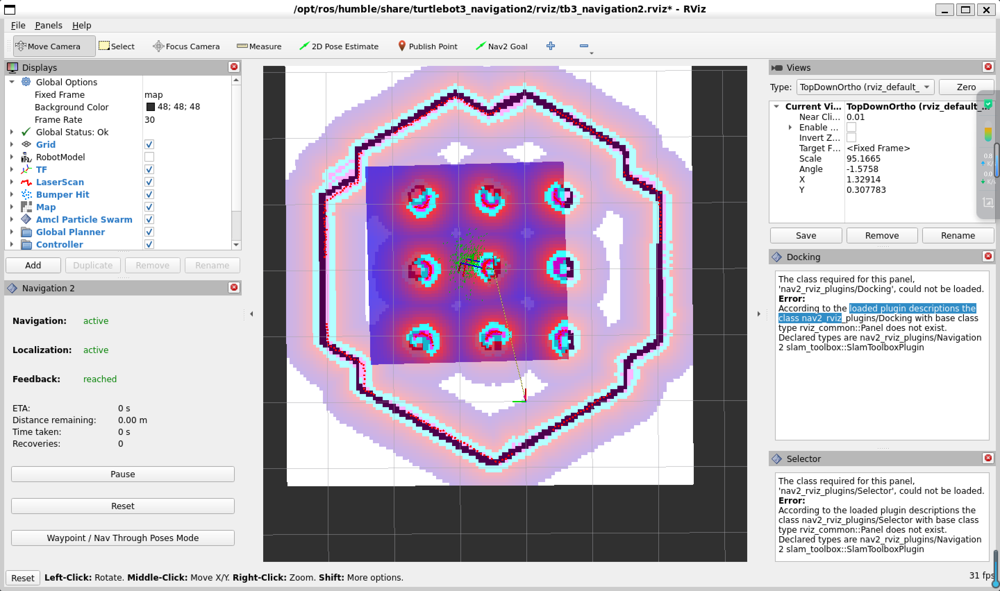
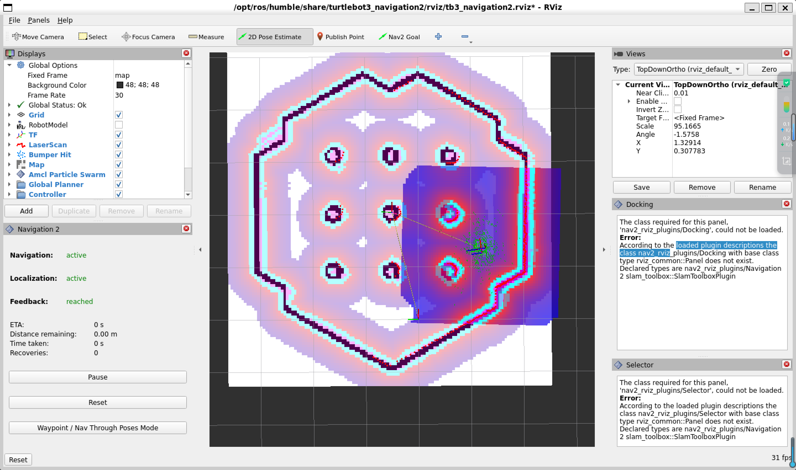

# ROS2 TurtleBot3 Autonomous Robot Project
## Project Overview

This project follows a modular ROS2 package design, separating perception, planning, and control components.

This project is a ROS2-based autonomous robot simulation using TurtleBot3, Gazebo, and RViz.

The robot can:

- move using velocity commands
- avoid obstacles using LiDAR
- build a map using SLAM
- navigate autonomously using a saved map

This project demonstrates a complete robotics workflow including simulation, mapping, and navigation.
## Robotics Concepts

This project demonstrates several key robotics concepts:

- ROS2 node communication (topics, publishers, subscribers)
- LiDAR sensor data processing
- SLAM (Simultaneous Localization and Mapping)
- Occupancy Grid Map generation
- Autonomous navigation using Navigation2
- Robot pose estimation and coordinate frames
## Environment

Operating System:
- Ubuntu 22.04 (WSL)

Robot Framework:
- ROS2 Humble

Simulation:
- Gazebo

Visualization:
- RViz2

Robot Model:
- TurtleBot3 Burger

Programming Language:
- Python
## Requirements

Install required ROS2 packages:

sudo apt install ros-humble-turtlebot3*
sudo apt install ros-humble-navigation2
sudo apt install ros-humble-cartographer*
sudo apt install ros-humble-gazebo-ros-pkgs
## Project Structure

```
my_robot/
├── my_robot/                # Core ROS2 Python nodes
│   ├── __init__.py
│   ├── hello_ros.py         # Basic ROS2 node example
│   ├── move_robot.py        # Velocity control node
│   ├── avoid_obstacle.py    # LiDAR-based obstacle avoidance
│   ├── slam_drive.py        # Manual driving during SLAM
│   └── exploration_node.py  # Frontier exploration (WIP)
│
├── launch/                  # Launch files
│   ├── sim.launch.py        # Launch Gazebo simulation
│   ├── slam.launch.py       # Launch SLAM (Cartographer)
│   └── nav.launch.py        # Launch Navigation2
│
├── maps/                    # Saved maps
│   ├── my_map.pgm
│   └── my_map.yaml
│
├── config/                  # Navigation parameters (Nav2 config)
│
├── screenshots/             # Visualization results
│   ├── gazebo.png
│   ├── slam_map.png
│   └── navigation.png
│
├── resource/                # ROS2 package resource index
│   └── my_robot
│
├── test/                    # Unit tests (optional)
│
├── package.xml              # ROS2 package metadata
├── setup.py                 # Python package setup
├── setup.cfg
├── README.md
└── .gitignore
```

## System Architecture

The robot system consists of several main modules:

Perception
    LiDAR sensor provides environment data

Mapping
    Cartographer SLAM generates an occupancy grid map

Localization
    AMCL estimates robot pose in the map

Planning
    Navigation2 global planner computes the path

Control
    Velocity commands are published to /cmd_vel
## System Pipeline
Gazebo Simulation
        ↓
Sensor Data (LiDAR)
        ↓
SLAM Mapping
        ↓
Map Generation
        ↓
Navigation2 Path Planning
        ↓
Robot Motion Control
## Build Workspace
```bash
cd ~/ros2_ws
colcon build
source install/setup.bash
```
## Run Simulation
```bash
source /opt/ros/humble/setup.bash
export TURTLEBOT3_MODEL=burger

ros2 launch turtlebot3_gazebo turtlebot3_world.launch.py
```
## Manual Control
```bash
source /opt/ros/humble/setup.bash
export TURTLEBOT3_MODEL=burger

ros2 run turtlebot3_teleop teleop_keyboard
```
Controls:

w - forward  
x - backward  
a - turn left  
d - turn right  
s - stop
## Obstacle Avoidance
```bash
cd ~/ros2_ws
source /opt/ros/humble/setup.bash
source install/setup.bash

ros2 run my_robot avoid_obstacle
```
## Frontier Exploration (Work in Progress)

This project also includes an initial frontier exploration module.

The exploration node subscribes to the `/map` topic, detects frontier cells
(unknown cells adjacent to known free space), and estimates the amount of
unexplored area in the environment.

Run:

```bash
cd ~/ros2_ws
source /opt/ros/humble/setup.bash
source install/setup.bash

ros2 run my_robot exploration_node
```
## SLAM Mapping
```bash
source /opt/ros/humble/setup.bash
export TURTLEBOT3_MODEL=burger

ros2 launch turtlebot3_cartographer cartographer.launch.py use_sim_time:=True
```
## Save Map
```bash
ros2 run nav2_map_server map_saver_cli -f ~/ros2_ws/src/my_robot/maps/my_map
```
## Autonomous Navigation
```bash
source /opt/ros/humble/setup.bash
export TURTLEBOT3_MODEL=burger

ros2 launch turtlebot3_navigation2 navigation2.launch.py \
map:=$HOME/ros2_ws/src/my_robot/maps/my_map.yaml \
use_sim_time:=True
```
## Important ROS2 Topics

/cmd_vel    Robot velocity commands  
/scan       LiDAR sensor data  
/map        Occupancy grid map  
/odom       Robot odometry  
/tf         Coordinate frame transformations
## Demo

Features demonstrated in this project:

- TurtleBot3 simulation in Gazebo
- LiDAR-based obstacle detection
- SLAM mapping
- Autonomous navigation
- ROS2 Python nodes
## Author

ROS2 Robotics Project

Author: MTMT
## Screenshots

### Gazebo Simulation



### SLAM Mapping



### Navigation

